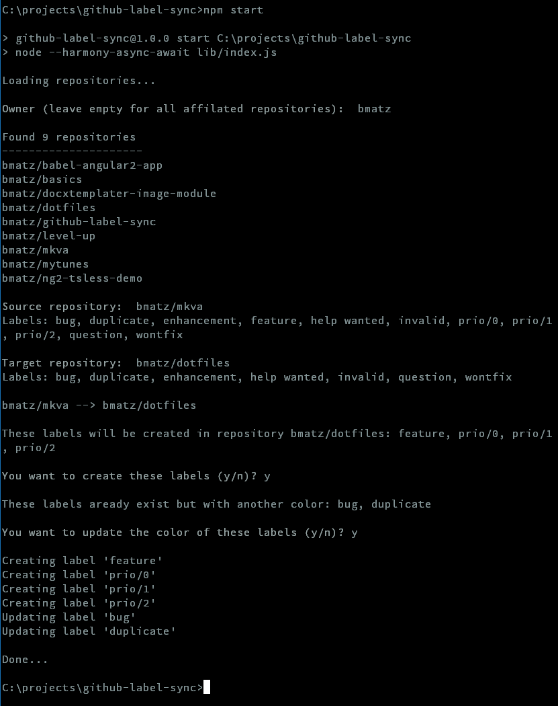

# github-label-sync

Node driven CLI to sync labels between github repositories.

The Application will only

* list your repositories
* create new labels
* update colors of existing labels

## Installation

Install via git clone

```bash
$ git clone https://github.com/bmatz/github-label-sync.git
$ cd github-label-sync
$ npm install
```

Run the application

```bash
$ npm start
```

## API Token

You will be prompted for a GitHub API token. You can enter your API token on the prompt or provide it via environment variable (GITHUB_API_TOKEN).
You can create a new GitHub API token here -> [https://github.com/settings/tokens](https://github.com/settings/tokens). Make sure to check 'repo - Full control of private repositories';

Linux
```bash
$ source GITHUB_API_TOKEN=123456789abcdef
```

Windows
```
set GITHUB_API_TOKEN=123456789abcdef
```

## Example



## LICENSE

MIT license. See the LICENSE file for details.
